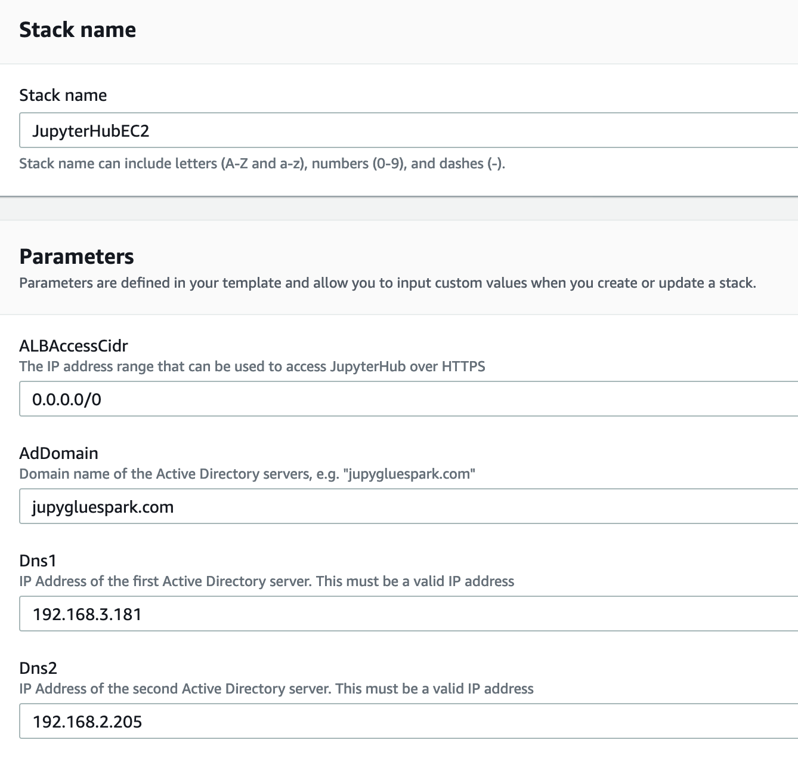
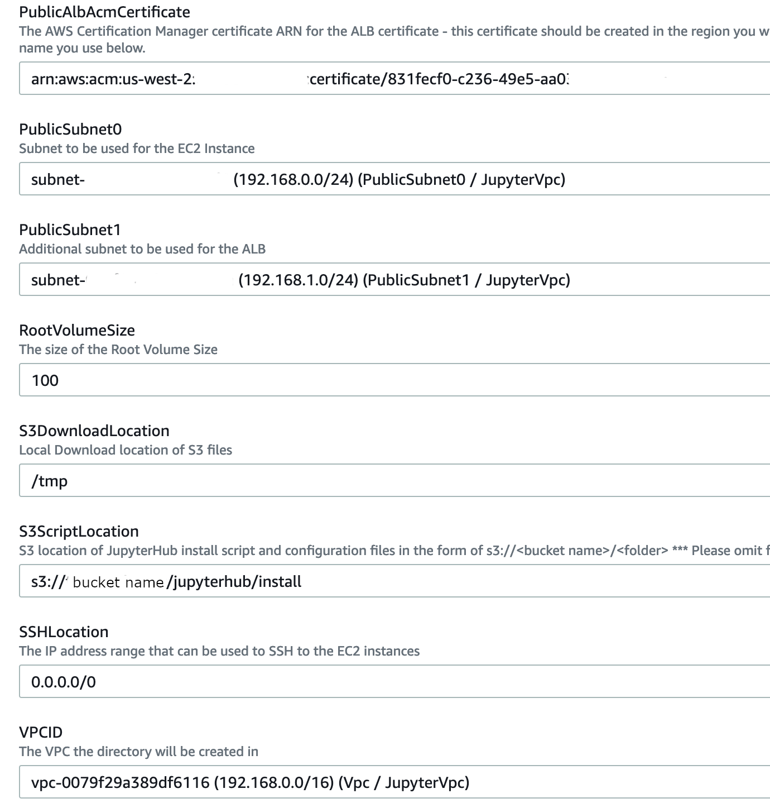

# Installing JupyterHub using CloudFormation Templates

## Pre-requisites
- Create or have a VPC set up that has a network set up with at least the following requirements below. Otherwise, use the Cloudformation template to set it up: [jupyterhub_vpc.yaml](https://github.com/mtwtan/glue_local_env_with_jupyter/blob/master/jupyterhub/cloudformation/jupyterhub_vpc.yaml)
  - Four (4) subnets that can route to each other:
    - Two (2) Public subnets that connects to an Internet Gateway
    - Two (2) Private subnets that can route to the Public subnets for the purpose of the Managed Active Directory; -or-
      - If you already have a working Active Directory that you have secured a network route from the public subnet above, there is no need to create the private subnets.
- Create a Managed Active Directory or have one that is accessible from the public subnets. Note: the LDAP plugin used in this JupyterHub set up does NOT work with the Simple AD or the AD connector; it only works with a Managed Active Directory or a full Windows Active Directory set up.
  - You can create it with this [CloudFormation template](https://github.com/mtwtan/glue_local_env_with_jupyter/blob/master/jupyterhub/cloudformation/jupyterhub_managed_ad.yaml) or follow the instruction in the [documentation here](https://docs.aws.amazon.com/directoryservice/latest/admin-guide/ms_ad_getting_started_create_directory.html).
- Create a Windows EC2 instance or have an existing instance that is joined to the Active Directory to manage the users that can connect to the JupyterHub set up here. To create one, here is the template to create a Windows EC2 instance: [jupyterhub_winrdp.yaml](https://github.com/mtwtan/glue_local_env_with_jupyter/blob/master/jupyterhub/cloudformation/jupyterhub_winrdp.yaml).
- Create a SSL certificate in Certificate Manager or import a SSL cert into there. Copy the ARN of the certificate to be used later for HTTPS connection
- Upload the files in [s3files](https://github.com/mtwtan/glue_local_env_with_jupyter/tree/master/jupyterhub/cloudformation/s3files) to an S3 location that will be used later in the CloudFormation template:
```
$ aws s3 cp jupyterhub_glue_setup.sh s3://<bucket name>/<folder name>/
$ aws s3 cp jupyterhub.conf s3://<bucket name>/<folder name>/
$ aws s3 cp jupyterhub.service s3://<bucket name>/<folder name>/
$ aws s3 cp kernel.json s3://<bucket name>/<folder name>/
$ aws s3 cp nginx.conf s3://<bucket name>/<folder name>/
```

## Installing via CloudFormation

- Note the IP addresses of the Active Directory servers. If you are using AWS Managed Active Directory, go to the console and copy the two (2) IP addresses here:

- Fill out the CloudFormation form according to something like this:






### Checking to see when the userdata script is completed

```
$ cd /var/log
$ tail -f cloud-init-output.log 
Downloading from aws-glue-etl-artifacts: https://aws-glue-etl-artifacts.s3.amazonaws.com/release/org/apache/hadoop/hadoop-annotations/2.6.5/hadoop-annotations-2.6.5.pom
Downloading from central: https://repo.maven.apache.org/maven2/org/apache/hadoop/hadoop-annotations/2.6.5/hadoop-annotations-2.6.5.pom
Downloaded from central: https://repo.maven.apache.org/maven2/org/apache/hadoop/hadoop-annotations/2.6.5/hadoop-annotations-2.6.5.pom (2.4 kB at 114 kB/s)
Downloading from aws-glue-etl-artifacts: https://aws-glue-etl-artifacts.s3.amazonaws.com/release/com/google/guava/guava/11.0.2/guava-11.0.2.pom
Downloading from central: https://repo.maven.apache.org/maven2/com/google/guava/guava/11.0.2/guava-11.0.2.pom

```


